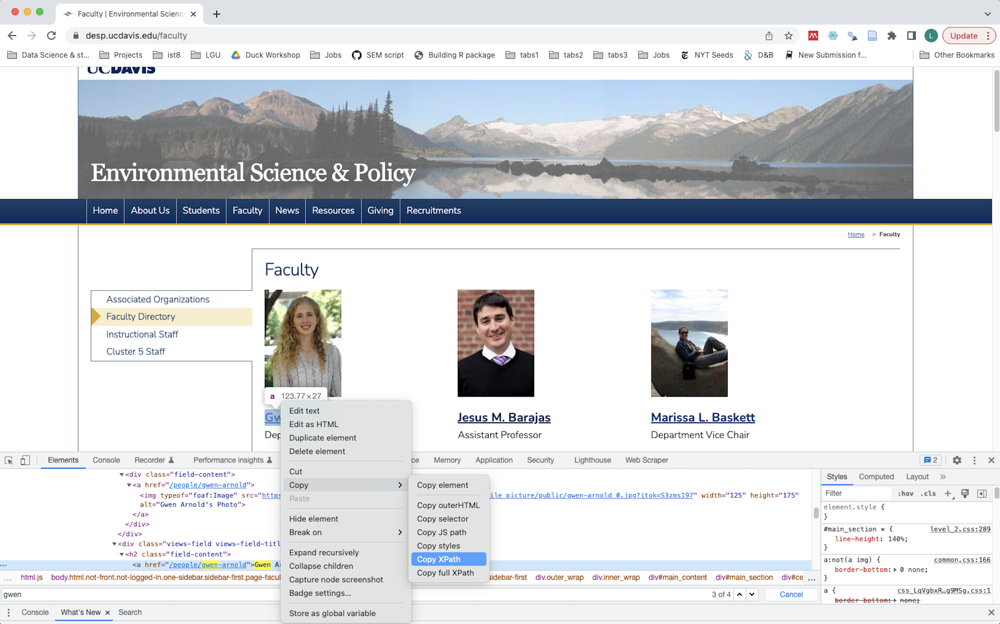

# Scraping unstructured data 

To scrape salaries from the public salary database, we first need to gather the names of the employees we want to collect salary data on. So let's go to a UC Davis website and find a departmental page with faculty names. I'll use the [Environmental Science and Policy Department](https://desp.ucdavis.edu/faculty) as an example.  

We should also load in the following libraries that we're going to use:

```{r}
library(rvest)
library(xml2)
library(dplyr)
```

## Reading in a webpage

Let's assign the URL to an object, and use the `read_html()` function to read the page.  

```{r}
url <- "https://desp.ucdavis.edu/faculty"
page <- read_html(url)
```

But the page is currently stored as HTML.  

```{r}
page
```

So what do we want out of this mess? We want to find the 'path' that defines the location of the things we're interested in extracting. But to know how to find that path we need to know a little bit about what's in a web page. This is not my expert area, so I'll point to a [UC Davis DataLab resource on web-scraping](https://ucdavisdatalab.github.io/adventures_in_data_science/getting-data-from-the-web.html#web-scraping) that describes elements of webpages and more about HTML and XML. 

For our purposes, it is important to know that **HTML and the related XML use 'tags' to mark different parts of the webpage's data**. What we need to identify are the appropriate tags or paths to extract what we want. We can do this by identifying the 'xpaths' -- the path of tags that highlight particular parts of a page. 

## Identifying xpaths

I don't use xpaths everyday, and so I tend to use two methods to help me identify the page's structure.  

1. For very specific paths, I will open up Developer Tools on a Browser using `Cmd + Opt + I`, then inspecting the elements of the page, `Ctrl + F` to find the text of what I am looking for in the webpage. Once you find it you can right click > Copy > Xpath. 

)

When I use this process for the first three names I find the following paths, each on unique their name:  
* Gwen Arnold: //*[@id="block-system-main"]/div/div/div/div[1]/div[2]/h2/a  
* Jesus Barajas: //*[@id="block-system-main"]/div/div/div/div[2]/div[2]/h2/a  
* Marissa Baskett: //*[@id="block-system-main"]/div/div/div/div[3]/div[2]/h2/a    

These are all too specific for trying to take all of the names with one path, but they do help us see the thing in common: All of these names are in the //*[@id="block-system-main"] path, which gives us a sense of what the more generic path might be. We can confirm with the second tool...  

2. The [InspectorGadget Chrome extension](https://chrome.google.com/webstore/detail/selectorgadget/mhjhnkcfbdhnjickkkdbjoemdmbfginb?hl=en) lets you click on blocks of a webpage and identify their Xpaths. When you use this gadget, you can see the more generic path to grab all of the names: //*[(@id = "block-system-main")]//a  


So, we can use this path to pull out the names -- turning structured data into data. We pull out the names with the `xml_final_all()` function, and then pipe that into the `html_text()` function, which read the text inside the XML nodeset.  

```{r}
faculty <- xml_find_all(page, '//*[(@id = "block-system-main")]//a') %>% 
  html_text()
```

Now we have faculty names, but it is a bit messy, so we can start to clean it up next:

```{r}
faculty
```
# Formatting unstructured data 

We have our faculty in a messy vector, so let's convert this some by turning it into a data frame and filtering out blanks.
```{r}
faculty <- faculty %>% 
  data.frame("name" = .) %>% 
  filter(name != "")
```

So, we have the data, but often you need to clean up text data to make it a little more usable. Let's look at the Transparent California webpage to understand how we want to feed these names into it.

## What format do we need the data in? 

If you start of Transparent California, you'll see a plain URL. One way of webscraping across multiple sites is to modify the URL for each page you want to scrape. If we dig into how URLs for pay in the UC system is stored, we find that it looks something like this: 
https://transparentcalifornia.com/salaries/search/?a=university-of-california&q=Mark+Lubell&y=2021

Let's look at the pattenr that we want to manipulate:
https://transparentcalifornia.com/salaries/search/?a=university-of-california&q=FIRSTNAME+LASTNAME&y=2021 

Let's use some string manipulation tools to extract the first and last names, and paste together those names in within the URL pattern
```{r}
library(stringr)
faculty <- faculty %>% 
  # takes first and last word
  mutate(name_first = word(name, 1), 
         name_last = word(name, -1)) %>% 
  mutate(url_name = paste(name_first, name_last, sep = "+"),
         url = paste0("https://transparentcalifornia.com/salaries/search/?a=university-of-california&q=", url_name, "&y=2021"))
```

# Scraping structured data iteravely  

## Scrape one example  
So let's figure figure out the xpath to scrape one person's salary data, then we can iterate across multiple names. 

Let's follow the same steps we used to scrape a faculty webpage. I know that there is a table in there, so I can use InspectorGadget to help me identify its path. 


Inspector gadget gave me //*[(@id = "main-listing")], which when run in `xml_find_all()` we see the output is a list with table elements.

```{r}
url <- "https://transparentcalifornia.com/salaries/search/?a=university-of-california&q=Mark+Lubell&y=2021"
page <- read_html(url) %>% 
  xml_find_all('//*[(@id = "main-listing")]')
page
```

Since we have a table, now instead of just reading the text we can use `rvest`'s `html_table()` function to read the table and wrap it in `data.frame()` to make it readable.

```{r}
table <- page %>% 
  html_table() %>% 
  data.frame()
table
```

## Iterating scrape across URLs  

Now we the know how to scrape one page, we want to generalize this scraping so that we can input multiple URLs. We've wrapped the earlier code into a function with only one argument -- the URL.

```{r}
scrape_fx <- function(URL){
  url <- URL
  df <- read_html(url) %>% 
    xml_find_all('//*[(@id = "main-listing")]') %>% 
    html_table() %>% 
    data.frame()
  return(df)
}
```

Now we can apply that function across all of the URLs so that we can compile salary data for all faculty.  

```{r}
salary.list <- lapply(faculty$url, scrape_fx)
salary.df <- do.call("rbind", salary.list)
```

Now we can take a look:  
```{r}
DT::datatable(salary.df)
```

# Cleaning with regex  


